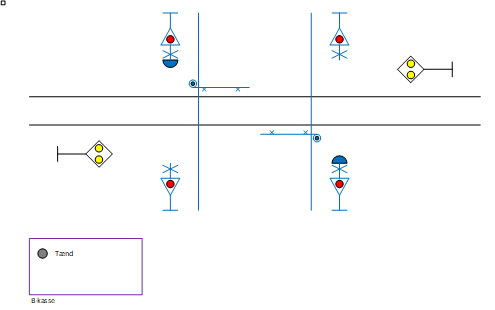

# Manuelt betjent halvbomanlæg
Til en modelbane bliver er der bygget en model af en overkørsel:
* For en station på en enkeltsporet strækning.
* Som halvbomanlæg med manuel betjening.

Model er bygget på breadboard og styres af en Arduino Uno. Modellen leverer.
* Trafikal beskrivelse.
* Softwarepakke til Arduino.
* Specifikation af tilslutning til hardware.

## Versionshistorik
Version	| Dato	   | Beskrivelse                               |
--------|----------|-------------------------------------------
1.0 |22-05-2021|Første version                             |

# Trafikal beskrivelse
Overkørsel består af:
* 2 uordenssignaler.
* 4 vejsignaler.
* 2 vejklokker.
* 2 vejbomme.
* Betjeningskasse:
  * Knap for manuel tænd.

# Tilstande
Overkørsel kan være i følgende tilstande.
1. Ikke sikret.
   1. Uordenssignal viser ”ikke sikret”.
   2. Vejlys og klokker er slukket.
2. Forringning.
   1. Vejlys blinker og klokker ringer.
   2. Skifter tilstand efter 7 sekunder.
   3. Overkørsel kan slukkes manuelt.
3. Vejbomme ned.
   1. Vejbomme sænkes.
   2. Skifter tilstand efter 16 sekunder.
4. Sikret.
   1. Uordenssignal viser ”sikret”.
   2. Skifter tilstand efter 25 sekunder.
5. Opløsning på tid.
   1. Uordenssignal viser ”ikke sikret”.
   2. Skifter tilstand efter 25 sekunder.
6. Vejbomme op.
   1. Vejbomme hæves.
   2. Skifter tilstand efter 16 sekunder.
7. Billisttid.
   1. Vejlys slukker.
   2. Varer i 25 sekunder.

SODB for overkørsler angiver meget længere tider, men det er længe at vente ved en modeljernbane.
Eventuelt justeres tider, så det passer bedre til publikums tålmodighed.

Se i øvrigt ”Tilstandsdiagram”.

# Model med Arduino
Arduiono har følgende ind- og udgange:
1.	Indgang: Knap for manuel tænd.
2.	Udgang køreretning AB: Uordenssignal gul LED. 
3.	Udgang køreretning BA: Uordenssignal gul LED. 
4.	Udgang vejlys: Rød LED.
5.	Udgang vejklokker: Aktiv buzzer.
6.	Udgang vejbomme: Servomotor.

Prototype er opstillet på breadboard og får de I/O som er vist herover.
Vejlys er styret af effektelektronik med 1 indgang koblet til Arduino.
Vejlys og vejbomme forsynes med separat strømforsyning.

Se i øvrigt ”Breadboard”. (Endnu ikke projekteret)
